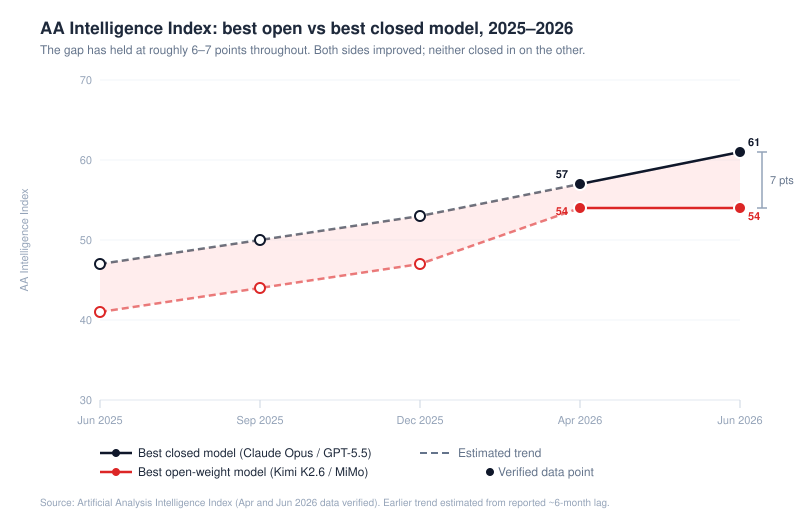
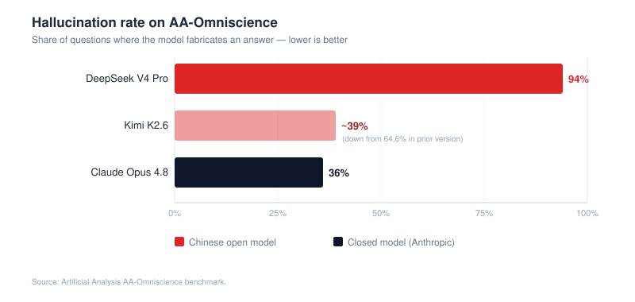
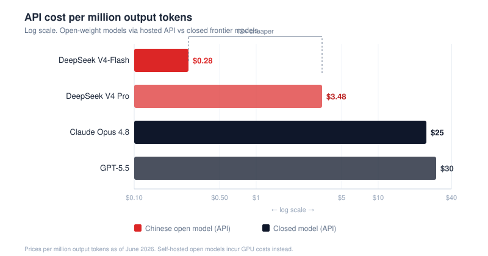
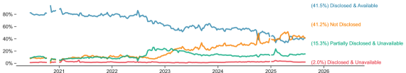
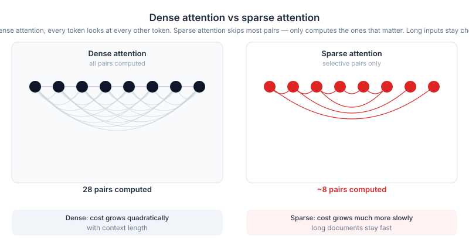
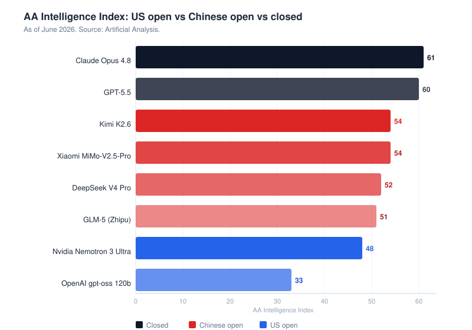
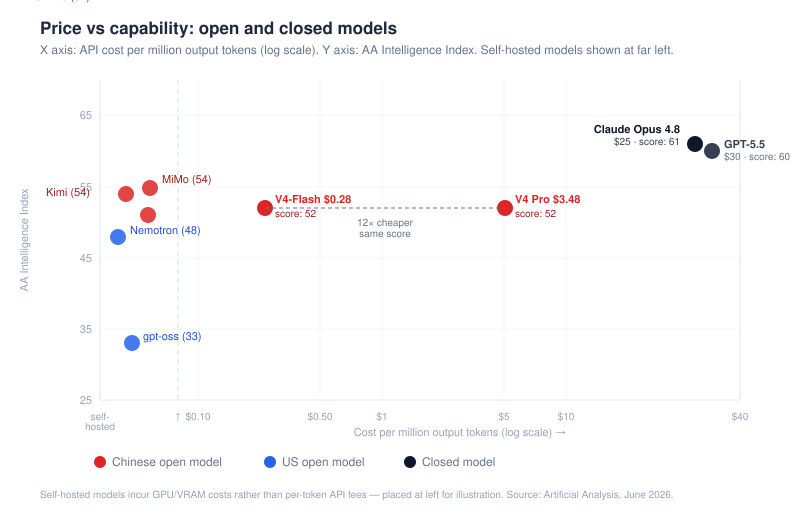
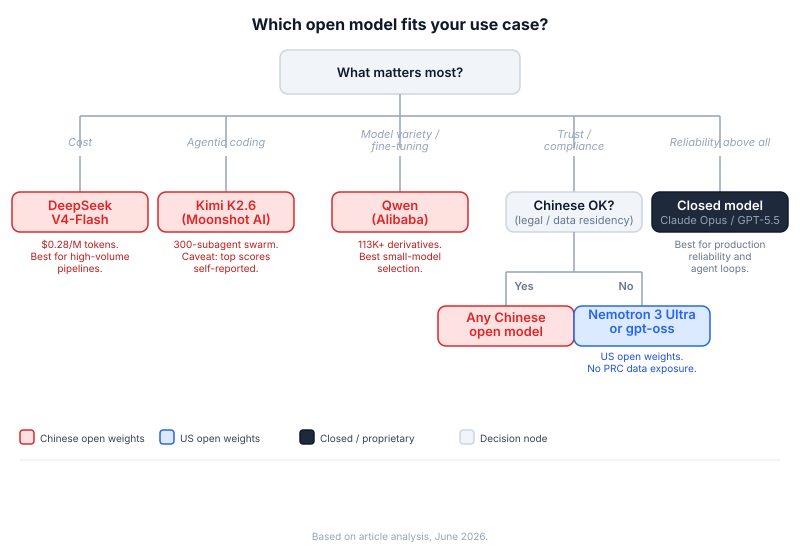
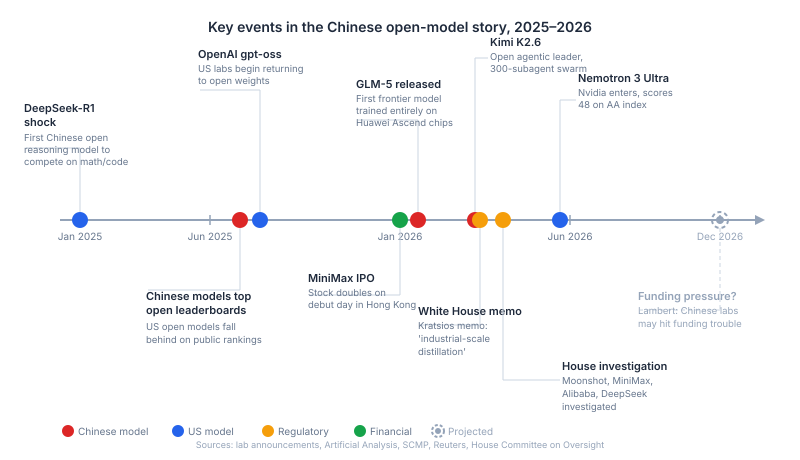

# The Open Model Playbook: How Chinese Labs Are Keeping Pace With Frontier AI

## TL;DR

- Open models are still behind the closed frontier. About 6-7 points on independent benchmarks, and that distance hasn't shifted much in a year. The current open model leader, Moonshot's Kimi K2.6, has a score of 54 on Artificial Analysis' intelligence index; the closed leaders sit at 61 (Claude Opus 4.8) and 60 (GPT-5.5). Open models improve mostly by training on closed models' outputs (distillation), so the closed frontier is always the ceiling of how well open models can perform.
- Open-weight models (downloadable and self-hostable, often under MIT or Apache 2.0 licenses) are far cheaper and more controllable but less reliable. DeepSeek V4 costs about $3.48 per million tokens versus $25 to $30 for closed flagships and can run on a company's own hardware, but open models hallucinate more and shift safety and compliance work onto the deployer. They suit high-volume, cost-sensitive, on-premise, and fine-tuned workloads, while closed models remain better for the most reliable general assistant and the strongest agentic tool use.
- There is no single best open model; the right choice depends on the task. DeepSeek is the cheapest, Moonshot's Kimi K2.6 is strongest for agentic coding, Alibaba's Qwen has the widest range and best fine-tuning support, GLM-5 (Zhipu) and DeepSeek lead on raw benchmarks, and DeepSeek-R1 is the one that started all of this (now the most-liked model in Hugging Face history). For production, the best pick is usually the cheap, stable, permissively-licensed model in the right size.
- Chinese labs use open releases as a distribution strategy ("the model is the marketing"), not because open models are technically superior. At least half a dozen labs compete, including DeepSeek, Alibaba (Qwen), Moonshot (Kimi), Zhipu (GLM), Xiaomi (MiMo), and MiniMax. Chinese open models now account for about 45% of OpenRouter token volume, up from under 2% a year earlier, and about 41% of Hugging Face downloads.
- The economics of open models are fragile. Open releases win developer adoption but little direct revenue, and some labs are closing up: Alibaba's flagship Qwen3.7 Max is closed and several labs are raising prices. The strongest models may move back behind paid APIs.
- US open models trail by single digits, not a chasm. Nvidia's Nemotron 3 Ultra (about 48 on the index) leads US open models, and OpenAI's gpt-oss and Google's Gemma are notable, but US frontier labs keep their best models closed for revenue reasons. Chinese labs are also shifting to domestic Huawei Ascend chips (GLM-5 was trained entirely on Ascend) to work around US chip restrictions.

## Introduction

If you've followed AI at all this past year, a Chinese open model has landed in the headlines every few weeks. DeepSeek in early 2025, then Qwen, then Kimi, then GLM, each one free to download and run yourself, each cheaper to call than the frontier models they've been chasing. By mid-2026 the top of the open-weight leaderboards contains a great number of Chinese model names, and a developer starting a project is about as likely to reach for Qwen or DeepSeek as for anything out of OpenAI. These models are often called "open-source," though the more precise term is "open weights": the model files are published for anyone to download, run, and fine-tune, as opposed to a closed model, like OpenAI's GPT-5.5 or Anthropic's Claude Opus 4.8, which you can only rent through an API.

The usual headline, "China caught up with the US," I think is too much of a simplification. Chinese labs didn't win on raw capability - US-based frontier labs are much more technically capable. What they did was turn open weights into a distribution strategy: publish the weights for free so any developer can run the model, and offer a hosted API priced below cost for everyone else and that allowed the adoption of these models to spread much faster to the public. Singapore picked Qwen over Llama for national infrastructure, Malaysia runs its sovereign AI stack on DeepSeek, Airbnb uses Qwen for customer support, Cursor built features on Kimi. The model becomes the marketing, and every fine-tune and derivative of a model spreads it further without the lab spending a dollar. What it doesn't do is close the capability gap. Open models are still running about six months behind the closed frontier, and that's held steady for over a year.

And if you came here to figure out which one to actually use, the honest answer up front is that there isn't a single best open model. Different labs lead on different things, so the right pick depends on the job in front of you. I'll get into which is which later on.

## 1. The race to reach the frontier

The numbers worth trusting come from independent scorers, not the labs' own marketing. Artificial Analysis publishes an intelligence index, a combination of reasoning, math, code, and knowledge evals rolled into one 0-to-100 score. As of June 2026 the top open-weight model, Moonshot's Kimi K2.6, sits at 54. The closed leaders, Claude Opus 4.8 and GPT-5.5, sit at 61 and 60. A 6 to 7 point spread.

When K2.6 launched in April that gap was only about 3 points, the closed leaders were at 57. Then the frontier moved up and the open top caught the old number. That's the pattern Nathan Lambert (Interconnects, the closest thing this space has to a sober scorekeeper) keeps flagging: the lag holds steady at roughly six months. Both sides improve, the distance barely moves. "Catching up" is the trajectory of any fast-follower, and so far, that's all it's been.

I should note though that this index also helps open models in a way. It's an average across reasoning, math, code, and knowledge, and it doesn't capture reliability in production, which is where the real difference shows. On AA-Omniscience, DeepSeek V4 Pro hallucinates on about 94% of the questions asked. Claude Opus 4.8 sits near 36%. That's not a six-point gap like we saw before, it's a whole different story. K2.6 cut its own rate to ~39% from 64.6% a version earlier, so it's getting closer. But open models are jagged: strong on code, shaky on tool use, and they make things up in ways closed flagships usually don't.

Companies that go open often end up running several models, each fine-tuned to a specific task, rather than one general-purpose assistant. And the biggest reason the capability gap is unlikely to close is distillation. The strongest open models are trained on the outputs of the strongest closed ones, which means the closed frontier is always their ceiling. As long as you're distilling from the frontier, you're always chasing it.

DeepSeek-R1 was the spark, the early-2025 release that proved a lean Chinese lab could ship an open reasoning model competitive on math and code. That's the origin story but not the whole picture. R1 is nearly a historical artifact and the action moved to a dozen labs doing something more deliberate than a one-off shock.

## 2. What you get, and what you give up

Before picking a model it helps to be honest about both sides, because the open-vs-closed choice has real trade-offs and it's not a free upgrade.

Let's start with what's good and most of it is money. DeepSeek V4 runs about $3.48 per million output tokens, and its smaller, cheaper V4-Flash tier drops to $0.28. The closed flagships sit around $25 (Claude Opus 4.8) and $30 (GPT-5.5) for the same million tokens. It's a different order of magnitude in terms of cost, and for anything high-volume and price-sensitive (extraction, agent loops and tool calls that burn tokens by the millions) it changes what's economically worth doing at all for many companies trying to adopt AI.

Then there is control. You have the weights, so you can run the model on your own hardware or in a private cloud, fine-tune it on your data, quantize it (shrink the numbers it stores to a lower precision so it fits a smaller GPU), and never send a customer record to someone else's API. That's a dream outcome for regulated industries and governments, and it's showing up in adoption: roughly 16 to 24% of US startups now build on Chinese base models, per an a16z estimate.

And the stuff diffuses fast. Qwen alone has more than 113,000 derivative models on Hugging Face, more than Google's and Meta's open releases COMBINED. A strong model drops on a Monday and by the weekend there are quantized builds, fine-tunes, and inference-provider listings for it.

So what negatives come along with them? The first catch hides in the word "open." Almost all of these releases are weights-only: you get the model files, not the training data, the data filters, or the recipe to reproduce it. Truly-open models (weights plus data plus training code) are getting rarer. The share of model downloads that shipped with disclosed training data fell from 79.3% in 2022 to 39% in 2025 (according to the "Economies of Open Intelligence" paper on arXiv), and weights-only releases passed truly-open ones for the first time. So "open-source AI" usually means free to run, not open to inspect.

Second, a launch-day benchmark is marketing until someone independent re-runs it. MiniMax M3 is the cautionary tale. It launched claiming 59.0% on SWE-bench Pro and a win over GPT-5.5, except every figure was measured on MiniMax's own infrastructure, the independent evals weren't in yet, and the open weights weren't even released on the day. It also compared itself to the older Opus 4.7. Opus 4.8 actually beats it, 69.2% to 59.0%. Grading your own homework, basically.

Third, "run it yourself" comes with a hardware bill. GLM-5 wants eight or more H200-class GPUs to serve, roughly 1.5TB of memory in full precision, a node north of $400,000. Kimi's own docs suggest 16-GPU clusters. For most teams self-hosting a frontier-size open model costs more than the closed API would, because you can't keep the GPUs busy enough to pay them off.

Fourth, the safety and legal work shifts onto you. No one is filtering outputs on your behalf or carrying the compliance risk, the deployer owns ALL of it. And Chinese models ship with content moderation aligned to government policy, which is reason enough to test them on your actual prompts before they go anywhere near a product.

So it nets out like this: open weights buy you cost and control. They do not buy you a free lunch on reliability, transparency, or operational simplicity. You're getting the savings up front and the costs later, which is a fine deal as long as you know both are coming. As a rough rule, reach for open when the work is high-volume, cost-sensitive, on-prem, or something you'll fine-tune, and stay with a closed model when you need the most reliable general assistant or the strongest agent loops.

## 3. What each lab shipped

A year ago you could tell this whole story with two names, DeepSeek and Qwen. That's no longer true. At least half a dozen Chinese labs now ship models that land near the top:

- DeepSeek (V4)
- Moonshot (Kimi K2.6)
- Alibaba (Qwen)
- Zhipu (GLM-5)
- Xiaomi (MiMo-V2.5-Pro)
- MiniMax (M3)

Here's who shipped what, and the one thing about each to note.

DeepSeek V4 (April 2026) is the cheapest of the serious open models and the one most people have heard of. It ships in tiers, with the full-size V4-Pro that posts the benchmark scores and a smaller, cheaper V4-Flash for high-volume work. Around 1.6 trillion parameters, a 1-million-token context window, and an MIT license, which means anyone can run, modify, and ship it commercially with almost no strings attached. It's a mixture-of-experts model, so only a fraction of those 1.6T parameters actually fire on any given token, which is how you serve something that big without the cost going completely crazy. Looking at the hardware: V4 is the first DeepSeek tuned for Huawei's Ascend chips instead of Nvidia, and the lab openly said it can't serve V4-Pro to most customers because it doesn't have enough of them. It's rare to see a frontier lab admit it's compute-constrained that plainly.

Kimi K2.6, which Moonshot shipped on April 20, is built around agents. A 1-trillion-parameter MoE with 32B active per token, natively multimodal, Modified MIT, and self-hostable. The standout feature is an agent-swarm mode that fans out to as many as 300 parallel subagents on one task, and the model is tuned hard for agentic coding (Terminal-Bench 2.0 at 66.7, SWE-bench Pro at 58.6, though that second figure was measured on Moonshot's own harness, so take that with a grain of salt). Right now it's the strongest open-weight model on the Artificial Analysis index.

Qwen, from Alibaba, is more an ecosystem than a single model. It has more than 113,000 derivative models on Hugging Face and somewhere near a billion cumulative downloads, in dense and MoE versions across every size, plus coding, vision, and embedding variants. Nobody else, open or closed, has that kind of variety. The catch is that the current flagship, Qwen3.7 Max, is closed - only the smaller 27B and 35B tiers are actually open. The lab with the biggest open model footprint kept its best model closed, a point I'll come back to at the end.

GLM-5 came out of Zhipu (also branded Z.ai) on February 11, and the notable thing about it is where it was trained. A 744B-total, 40B-active MoE trained on 28.5 trillion tokens entirely on Huawei Ascend chips, with no CUDA and no Nvidia hardware anywhere in the run. That doesn't sound too impressive until you remember that almost every model you've heard of, GPT, Claude, Gemini, Llama, and nearly every other Chinese model too, was trained on Nvidia GPUs running Nvidia's CUDA software. The whole field sits on one company's stack, and that dependence is why US export policies focus a lot on chip access: the whole field trains models on Nvidia hardware, so whoever has those chips has the advantage. GLM-5 is the counter-move, a model trained start to finish on domestic Chinese silicon that still hits 77.8% on SWE-bench Verified. A year ago people weren't sure that could be done at all.

It also borrows a method DeepSeek published called sparse attention. Normally every token in the context has to attend to every other token, which gets expensive fast as the input grows long; sparse attention skips most of those comparisons and only computes the ones that are actually useful, so long inputs stay cheap to run.

Xiaomi MiMo-V2.5-Pro. A phone company's model ties with Kimi for the top open-weight spot on the Artificial Analysis index, both sitting at 54. A lab nobody had in the frontier conversation a year ago is now tied for first. It's hard to keep calling this a two-lab race after that.

MiniMax went public in Hong Kong in January 2026 and the stock doubled on its first day. Its benchmark claims were still unconfirmed by independent evals at launch, but investors doubled the company's value in a day anyway. That tells you how much capital is chasing this space right now.

| Lab | Model | Released | Parameters | License | AA Score | Known for |
|---|---|---|---|---|---|---|
| DeepSeek | V4 Pro | Apr 2026 | 1.6T total (MoE) | MIT | 52 | Cheapest API — $3.48 / $0.28 Flash |
| Moonshot | Kimi K2.6 | Apr 20, 2026 | 1T / 32B active (MoE) | Mod. MIT | 54 | Agentic coding, 300-subagent swarm |
| Alibaba | Qwen3.7 | 2026 | Various (dense + MoE) | Mixed (Max closed) | — | Widest ecosystem, 113K+ derivatives |
| Zhipu | GLM-5 | Feb 11, 2026 | 744B / 40B active (MoE) | — | 51 | Trained on Ascend end-to-end |
| Xiaomi | MiMo-V2.5-Pro | 2026 | — | — | 54 | Tied for open leader |
| MiniMax | M3 | 2026 | — | — | unverified* | HK IPO Jan 2026, stock doubled day one |

*AA Score = Artificial Analysis Intelligence Index as of June 2026. MiniMax M3 score is self-reported; independent verification pending.

## 4. Why give the model away

Nobody spends nine figures on a training run and then gives the result away out of generosity. Open release is a go-to-market move. The way that China is playing it, the model is the marketing.

Most of the serious labs run roughly the same sequence:

- Release fast and often, on a cadence measured in weeks, not quarters.
- Tune hard for the public benchmarks, because a top score is what gets the model noticed.
- Ship day-one support for the tools developers already use.
- Price the hosted API well under the closed labs.
- Worry about revenue later, through cloud and enterprise, once the attention is already there.

Two of those moves do most of the work. The first is day-one support. When Kimi K2.6 dropped, the weights were on Hugging Face the same hour, there was a path through vLLM (the open inference server most self-hosters run), a listing on OpenRouter (a marketplace that routes your API calls across providers), quantized builds small enough for a laptop, and hooks into the coding agents within a day. A developer can go from reading the announcement to calling the model in production before lunch, without asking anyone's permission and without signing a contract with a US provider. That permissionless path is the real advantage, more than any single benchmark score.

The second is price, set deliberately low as a tactic. DeepSeek V4 runs $3.48 per million tokens against $25 to $30 for the closed flagships. At that level the lab makes little or nothing on the API, and that's the point. The cheap price makes the closed API look expensive and pulls usage volume. Where the money is meant to come from depends on the lab. Alibaba has the cleanest answer: Qwen is free, but companies that build on it rent the GPUs and hosting to run it from Alibaba Cloud, so the free model funnels paying customers into a cloud business that already exists. The pure labs, DeepSeek and Moonshot and MiniMax, have no cloud to funnel anyone into. For them the cheap price is mostly advertising, the model is the marketing, and partly something they can't avoid: Chinese labs all compete on price and performance at once, so charging more isn't really on the table. What that doesn't add up to yet is a clear way to make money, which is the question I come back to in Section 8. AIProem calls the whole thing a race to the bottom on API sales.

Which raises the obvious question: why pour a fortune into a model and then give it away? Advertising is part of it, since every fine-tune and derivative of the original model spreads it further. But the bigger reason, per the USCC's "two loops" report, is strategy. A Chinese lab cut off from the best Nvidia chips is short on compute. An open-weights release hands the model to the whole world, and every developer who runs it, reports a bug, or fine-tunes it is doing work the lab would otherwise burn its own compute on. China's openness strategy buys back some of the progress the chip restrictions were meant to block.

So the labs aren't ahead because their models are better. They aren't, they sit a few points back, like I said up top. They're ahead because giving the model away is how they advertise. Someone downloads it for free, builds something with it, and that pulls in the next person. And it worked. Chinese open models were under 2% of OpenRouter's token traffic a year ago. Now they're around 45%, and 41% of downloads on Hugging Face, more than any other country. Hardly anyone on the closed side played it this way until OpenAI's gpt-oss, and that's a recent thing.

## 5. Chips, trust, and regulation

Everything so far has been about the models themselves, how good they are and what they cost. The mid-2026 news has mostly been about the layer underneath: the chips they run on, the lawsuits over how they were trained, and whether a Western company can trust them at all.

Start with chips, the biggest shift. DeepSeek V4 was optimized to run inference on Huawei's Ascend hardware, reportedly at Beijing's nudging, with claimed cuts of 73% to inference compute and 90% to the KV cache (the memory a model uses to hold a conversation's context, which balloons as the context gets longer). Huawei announced full Ascend support, and GLM-5 was trained on Ascend end to end. The catch is that running a finished model and training one in the first place are two different jobs, and China's chip independence is much further along on the running side. US officials say V4 was still trained on smuggled Nvidia Blackwell chips, and DeepSeek itself admitted it can't yet serve V4-Pro at scale because it doesn't have enough hardware. So the move off Nvidia is real for running models and still aspirational for training them.

| | Training new models | Running finished models |
|---|---|---|
| **Status** | Still Nvidia-dependent | Ascend making progress |
| **Key hardware** | Nvidia Blackwell GPUs (required) | Huawei Ascend chips |
| **Evidence** | US officials say V4 was trained on smuggled Blackwell chips | GLM-5: first frontier model trained start-to-finish on domestic silicon |
| **DeepSeek V4** | Admits it can't serve V4-Pro at scale — not enough hardware | 73% inference compute reduction on Ascend (claimed) |

The second thing is trust, and for most Western companies it matters more than capability. China's National Intelligence Law requires Chinese companies to "support, assist, and cooperate with" state intelligence. If you're running the open-weight models on your hardware that is less of a concern. The hosted APIs are a different matter, and so is the content filtering and political slant trained into the model itself. It's the concern that comes up in every enterprise deal, and no benchmark score can make up for that.

Washington has noticed. On April 23, 2026 the White House science adviser Michael Kratsios put out a memo. Chinese labs are copying US models to build their own cheaply. The way they do it is called distillation. You take a stronger model, feed it lots of prompts, and train your own model on its answers until it behaves the same way. That is far cheaper than building a model from scratch, and it breaks the rules US labs set for using their products. In response, a House bill would name and sanction the labs doing it, and on April 29 a House investigation opened into Moonshot, MiniMax, Alibaba, and DeepSeek. Anthropic and OpenAI both say DeepSeek did this to their models, using more than 24,000 fake accounts and 16 million interactions.

The next round of competition is moving past chatbots, toward agents, coding tools, long-context work, models run on a company's own servers, and AI built into physical robots. That shift is the one area the US chip restrictions can't reach. Once a model is deployed and being used in the real world, it keeps producing data and feedback no matter who makes the chips. The chip fight happens before a model ships. The fight that actually decides who wins happens after, wherever these models get put to work.

## 6. Which model to use

This is the section you probably came for. Like I said up top, there's no single best open model, four labs lead four different things, and the only useful question is which one fits the job in front of you.

Start with raw capability, since that's what people reach for first. On the Artificial Analysis index, the open frontier is bunched tight. Kimi K2.6 and Xiaomi MiMo-V2.5-Pro both sit at 54, DeepSeek V4 Pro at 52, GLM-5 at 51. The closed leaders sit clear above them, GPT-5.5 at 60 and Opus 4.8 at 61. You won't find Qwen3.7 Max on the open list even though it scores well, because Alibaba kept it closed. And the order changes depending on the scoreboard. BenchLM, which weights things differently, puts DeepSeek V4 Pro on top at 87, then Kimi at 84, then GLM at 83. So which model is "number one" depends mostly on whose scoreboard you're reading.

Here's how it breaks down by use case:

- Cheapest, for high-volume automation: DeepSeek. Nothing else is close on price (the $3.48, and $0.28 on the Flash tier).
- Agentic coding and tool use: Kimi K2.6, with one caveat. Its best coding scores were measured on Moonshot's own harness, so expect a little less in your own setup.
- Fine-tuning, or a specific size or language: Qwen, and it isn't close. It comes in every size, dense and MoE, with vision, coding, and embedding variants, and the best fine-tuning support of any open family. Start here if you're customizing.
- If you just want whatever sits highest on the leaderboard: GLM-5 or DeepSeek V4 Pro, depending on the scoreboard. Though the gap up there is a point or two, and a benchmark lead rarely holds up on your own workload, so it's the weakest reason to pick one.
- For production: a closed model is often the better call on reliability. Open only makes sense in a few cases, high-volume work where cost is the main concern, data that can't leave your own servers, or a task you've fine-tuned for. In those cases, pick the cheap, stable, well-served open model, not the highest-scoring one.

The benchmark leader and the right production choice are often different models, because in production you care about reliability, latency, cost, uptime, license terms, and how well your provider actually serves the thing.

Of those, reliability is the one we have real data for, at least for some models. I gave the numbers back in Section 1. DeepSeek V4 Pro made things up on about 94% of AA-Omniscience questions, Claude Opus 4.8 on 36%, and Kimi K2.6 on around 39%, the one open model that gets close to a closed one. Those two are the only open models with a hallucination score you can trust. Nobody has a solid number for Qwen3.7, GLM-5, MiMo, or MiniMax M3 yet, so be cautious with those models for now.

Which brings up the last caveat. These rankings move fast. The top open-weight slot has changed hands more than once on a roughly 72-hour cycle this year. And the same model is not the same model on two providers. The weights are identical, but the way each host serves them isn't. The biggest lever is quantization. To save memory and cost, a provider can run the weights at a lower precision, say 4-bit instead of the original 16-bit, which makes the model cheaper and faster but measurably worse. Prompt formatting and the way tool-calling is wired up vary by host too. Treat any leaderboard, including the numbers in this section, as a snapshot with a short shelf life, and test on your own workload before you commit.

## 7. Where the US open scene has a leg up

If the first reflex is "China caught up," the second is "the US gave up on open models." Which isn't quite it. The US open scene trails behind a bit but not by that much. US open models didn't disappear, they just stopped getting the attention. And for Western companies where Chinese models are a non-starter on trust grounds, the US open scene is where they actually look.

Meta was leading the open-model scene, releasing very capable models on Hugging Face. Llama 2 and Llama 3 were the default open models, the thing everyone fine-tuned. Then Meta slowed down. Nathan Lambert put it bluntly: "the soul of the Llama series died by not releasing enough models frequently enough." Llama 4, in April 2025, was one of the stranger releases of the year. Its headline LMArena score of 1417 came from a special arena-tuned version of Maverick that Meta never actually shipped, which is about as close to faking a benchmark as a major lab has come. By that August the top open models on the LMArena board were all Chinese.

OpenAI came back to open weights in August 2025 with gpt-oss, two models (120b and 20b) under the permissive Apache 2.0 license, with the 120b running near o4-mini quality on a single 80GB GPU. That's a genuinely useful model. But OpenAI pitched it as a complement to its closed API, something to run locally when you can't call the big model, rather than a Llama-style "use this for everything" default. On the Artificial Analysis index it sits at 33, well back from the frontier.

The current US open leader is actually Nvidia. Nemotron 3 Ultra, out June 4, 2026, scores about 48 on the index, six points behind Kimi K2.6 at 54. Nvidia is putting something like $26 billion behind open-weight work, so that gap may close quite quickly and I think Nvidia is the most well-positioned company to challenge the Chinese open models market. Nvidia isn't alone either: Ai2's OLMo 3, Google's Gemma 4 (Apache 2.0, which Lambert called "a wild success"), IBM Granite, Arcee, and Reflection are all putting out US open models.

There's also a push to keep at least one US lab fully in the open. Lambert's ATOM Project argues for training truly-open models, meaning open data and training code and not just released weights, on a cluster of 10,000-plus leading-edge GPUs. It grew out of the summer of 2025, when Chinese models passed US ones on the open leaderboards and it became clear nobody on the US side was committed to staying open at the frontier.

gpt-oss and Gemma are real advances for US open weights, genuinely useful, but the frontier labs have every reason to keep their best models behind a paid API. It's a pure revenue thing, and you can't really blame them for it, not with the mammoth R&D bills and investors who want a return. So the useful open models keep coming while the strongest systems stay closed. The open-weight default went to China, and the US is competing to win it back rather than conceding it.

## 8. Why this might not last

Releasing open weights wins developers and accelerates technological advancements but unfortunately, bills still need to be paid.

The cloud and enterprise revenue is supposed to arrive later for China, but the same distribution strategy that won all those developers (releasing fast and pricing low) also created a market where the labs are racing each other to the bottom on price. It's not clear who turns that attention into a proper business, and Nathan Lambert (Interconnects) thinks the Chinese open-weight labs run into funding trouble before the US ones do, maybe as soon as late 2026.

That's already showing up in how labs are behaving. Qwen3.7 Max, Alibaba's flagship, shipped closed, with only the smaller tiers as open models. Z.ai has started releasing some models closed-first and raising prices. Reuters has written about the "open-source dilemma" these labs are in: the open releases built the mindshare, but cloud bills are no joke and investors want returns. The model that made them famous is the one they can least afford to keep giving away.

What stops everyone from closing up all their models at once is a standoff that the Chinese labs have put themselves in. As long as one capable lab keeps shipping open weights, the others can't fully close without handing the whole open market to that competitor. So the models stay open, for now. Whichever lab closes first loses its developer base to whoever doesn't.

The big question is whether open models settle into a permanent cheaper option alongside the closed frontier, or stay what they mostly are today: a few months behind, good for a lot of tasks but not the first choice when tasks start getting complicated. I think it's the second. The financial pressure, the trust and regulation problems, the need to eventually show investors a return, all point that way. Open models exist right now because enough big players still find it worth giving them away. When that stops, expect the best ones to move back behind a paid API.

## Conclusion

Chinese labs won on distribution, not capability. The models are free to download and cheap to call, and that took them from under 2% of OpenRouter traffic a year ago to about 45% now. The capability gap is small, six to seven points on the Artificial Analysis index, and it hasn't moved much in a year. Open models mostly learn from the outputs of closed models, so the frontier stays ahead. What you get is a model far cheaper than a closed one, and one you can run yourself. What you lose out on a bit is reliability, plus the trust questions a Chinese model carries. There's no single best one. The right pick depends on the job.

Two questions are still open. Can the labs make money before the funding runs out? And can China train its own frontier models, not just distill US-based ones? The answers settle the bigger question from Section 8, whether open stays a step behind for good. My bet there hasn't changed. Until then, test these models on your own workloads rather than trust benchmarks.
